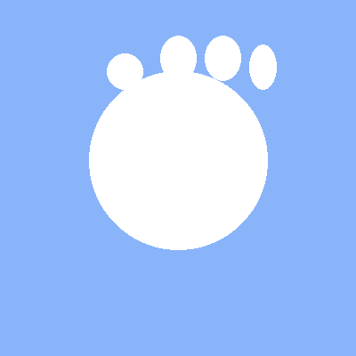
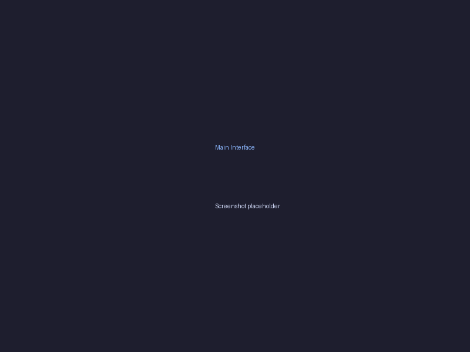
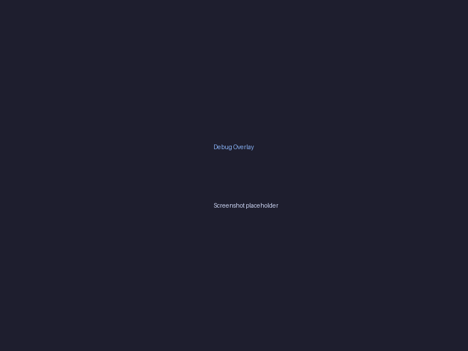

# ✋ AirTouchPad

<div align="center">



**Control Your Computer with Hand Gestures**

[](https://opensource.org/licenses/MIT)
[](https://www.python.org/downloads/)
[](https://github.com/yourusername/AirTouchPad)
[](http://makeapullrequest.com)

[Features](#-features) • [Installation](#-installation) • [Usage](#-usage) • [Gestures](#-gesture-controls) • [Contributing](#-contributing)

</div>

---

## 🌟 Overview

**AirTouchPad** is an AI-powered hand gesture recognition system that transforms your webcam into a touchless control interface for your computer. Say goodbye to your mouse and keyboard—control everything with simple hand movements!

### ✨ Why AirTouchPad?

- 🎯 **31 Unique Gestures** - Comprehensive control system
- 🚀 **Real-time Processing** - <50ms latency for responsive control
- 🔒 **Privacy-First** - All processing happens locally on your device
- 🌐 **Cross-Platform** - Works on Windows, macOS, and Linux
- 💡 **Zero Hardware Required** - Uses your existing webcam
- 🎨 **Customizable** - Adjust sensitivity and gestures to your preference

---

<!--
## 📸 Screenshots

<div align="center">

### Main Interface


### Installation Wizard


### Gesture Tutorial


### Debug Overlay


</div>
-->
---

## 🚀 Features

### 🖱️ Mouse Control
- **Left Click** - Index-thumb pinch (right hand)
- **Right Click** - Index-middle pinch (right hand)
- **Middle Click** - Thumb-middle pinch (right hand)
- **Drag & Drop** - Hold pinch and move
- **Scroll** - Two-finger pinch + vertical movement
- **Horizontal Scroll** - Two-finger pinch + horizontal movement

### ⌨️ System Controls
- **App Switching** - Three-finger horizontal swipe
- **Task View** - Three-finger swipe up
- **Show Desktop** - Three-finger swipe down
- **Screenshot** - Three-finger tap
- **Window Snapping** - Gesture-based window management
- **Lock Screen** - Bring hands together

### 🎵 Media Controls
- **Volume Up/Down** - Left hand pinch gestures
- **Mute/Unmute** - Three-finger tap (left hand)
- **Play/Pause** - Media gesture
- **Next/Previous Track** - Horizontal swipe (left hand)

### 💡 Display Controls
- **Brightness Up/Down** - Finger spread/pinch (left hand)
- **Zoom In/Out** - Two-hand pinch spread/contract
- **Rotate** - Rotate both hands

### 🎮 Advanced Features
- **Custom Gesture Mapping** - Define your own gestures
- **Multi-Display Support** - Works across multiple monitors
- **Calibration Wizard** - Automatic threshold optimization
- **Debug Overlay** - Real-time hand tracking visualization
- **System Tray Mode** - Run in background

---

## 💻 Installation

### Prerequisites

- Python 3.8 or higher
- Webcam
- Operating System: Windows 10/11, macOS 10.14+, or Linux (Ubuntu 20.04+)

### Quick Start

1. **Clone the Repository**
   ```bash
   git clone https://github.com/yourusername/AirTouchPad.git
   cd AirTouchPad
   ```

2. **Run the Launcher** (First-time setup will auto-install dependencies)
   ```bash
   python launcher.py
   ```

(If working with WSL-2)
   ```bash
   python launcher_wsl.py
   ```

3. **Follow the Installation Wizard**
   - Accept the license agreement
   - Wait for automatic dependency installation
   - Complete the setup

4. **Calibrate Your Camera**
   - Click "Calibration" in the main interface
   - Follow on-screen instructions
   - Perform each gesture for 5 seconds

5. **Start Using AirTouchPad!**
   - Click "Start AirTouchPad"
   - Begin controlling your computer with gestures

### Manual Installation

If you prefer manual installation:

```bash
# Create virtual environment
python -m venv venv

# Activate virtual environment
# On Windows:
venv\Scripts\activate
# On macOS/Linux:
source venv/bin/activate

# Install dependencies
pip install -r requirements.txt

# Run AirTouchPad
python launcher.py
```

---

## 🎯 Usage

### Starting AirTouchPad

1. Launch the application: `python launcher.py`
2. Click "Start AirTouchPad" in the main window
3. Position your hands in front of the camera
4. Perform gestures to control your computer

### Running in Background

- Click the minimize button or close the window
- Select "Minimize to system tray"
- AirTouchPad continues running in the background
- Access via system tray icon

### Calibration

For best results, calibrate your camera:

1. Open the main interface
2. Click "Calibration"
3. Follow prompts to record each gesture:
   - Right hand pinch
   - Left hand pinch
   - Two-finger gestures
4. Click "Compute & Save"

---

## 🤚 Gesture Controls

### Right Hand Gestures

| Gesture | Action | Description |
|---------|--------|-------------|
| 👆 Index-Thumb Pinch | Left Click | Quick tap |
| ✌️ Index-Middle Pinch | Right Click | Context menu |
| 👌 Thumb-Middle Pinch | Middle Click | Open in new tab |
| ✊ Hold Pinch | Drag | Hold and move |
| 📜 Two-Finger + ⬆️⬇️ | Scroll | Vertical scrolling |
| ↔️ Two-Finger + ⬅️➡️ | H-Scroll | Horizontal scrolling |
| 🔄 Three-Finger Swipe | App Switch | Alt+Tab |
| ⬆️ Three-Finger Up | Task View | Win+Tab |
| ⬇️ Three-Finger Down | Show Desktop | Win+D |
| 📷 Three-Finger Tap | Screenshot | Win+PrintScreen |
| 🪟 Four-Finger Swipe | Virtual Desktop | Navigate workspaces |
| ⬅️ Snap Left | Window Left | Win+Left |
| ➡️ Snap Right | Window Right | Win+Right |

### Left Hand Gestures

| Gesture | Action | Description |
|---------|--------|-------------|
| 🔊 Index-Thumb Pinch | Volume Up | Increase volume |
| 🔉 Thumb-Middle Pinch | Volume Down | Decrease volume |
| 🔇 Three-Finger Tap | Mute/Unmute | Toggle mute |
| 💡 Index-Middle Spread | Brightness Up | Increase brightness |
| 🌙 Index-Middle Pinch | Brightness Down | Decrease brightness |
| ⏯️ Hold Pinch | Modifier Hold | Special modifier |
| ⏩ Swipe Right | Next Track | Skip forward |
| ⏪ Swipe Left | Previous Track | Skip back |
| ⏸️ Tap | Play/Pause | Toggle playback |

### Both Hands Gestures

| Gesture | Action | Description |
|---------|--------|-------------|
| 🔍 Pinch Both + Spread | Zoom In | Ctrl++ |
| 🔎 Pinch Both + Contract | Zoom Out | Ctrl+- |
| 🔄 Rotate Hands | Rotate | Image/object rotation |
| 🔒 Hands Together | Lock Screen | Lock workstation |
| 📢 Both Hands Up | Notifications | Open notification center |
| ⚙️ Both Hands Down | Quick Settings | System settings |

---

## ⚙️ Configuration

### config.json

Customize AirTouchPad behavior by editing `config.json`:

```json
{
  "CAP_WIDTH": 640,
  "CAP_HEIGHT": 480,
  "PINCH_THRESHOLD": 0.04,
  "TWO_FINGER_THRESHOLD": 0.05,
  "HOLD_TIME": 0.35,
  "BUFFER_LEN": 8,
  "COOLDOWN": 0.25,
  "DEBUG_OVERLAY": true
}
```

**Parameters:**
- `CAP_WIDTH/HEIGHT`: Camera resolution
- `PINCH_THRESHOLD`: Sensitivity for pinch detection (lower = more sensitive)
- `TWO_FINGER_THRESHOLD`: Two-finger gesture sensitivity
- `HOLD_TIME`: Duration to trigger hold gesture (seconds)
- `BUFFER_LEN`: Motion smoothing buffer size
- `COOLDOWN`: Minimum time between gesture triggers (seconds)
- `DEBUG_OVERLAY`: Show hand tracking visualization

---

## 🏗️ Architecture

```
AirTouchPad/
├── launcher.py              # Main entry point
├── installer_wizard.py      # First-run setup wizard
├── main_gui.py             # Main application interface
├── beast_core.py           # Core gesture processing loop
├── handtracker.py          # MediaPipe hand tracking
├── gesturelogic.py         # Gesture recognition engine
├── eventmapper.py          # System event dispatcher
├── os_handlers.py          # OS-specific implementations
├── calibration.py          # Calibration utility
├── debug_display.py        # Visual debugging tool
└── utils/
    ├── config.py           # Configuration manager
    └── system_tray.py      # System tray integration
```

### Technology Stack

- **Computer Vision**: MediaPipe, OpenCV
- **GUI Framework**: Tkinter
- **System Control**: PyAutoGUI
- **Hand Tracking**: MediaPipe Hands (Lite model)
- **Image Processing**: OpenCV 4.8+

---

## 🐛 Troubleshooting

### Camera Not Detected
- Ensure camera permissions are granted
- Check if another application is using the camera
- Try changing camera index in code (default is 0)

### Gestures Not Recognized
- Run calibration to optimize thresholds
- Ensure good lighting conditions
- Keep hands clearly visible to camera
- Adjust `PINCH_THRESHOLD` in config.json

### High CPU Usage
- Reduce camera resolution in config.json
- Close debug overlay when not needed
- Disable `DEBUG_OVERLAY` in config

### Lag or Delay
- Lower `BUFFER_LEN` for faster response (less smoothing)
- Reduce `COOLDOWN` value
- Close resource-intensive applications

---

## 🤝 Contributing

We welcome contributions! Here's how you can help:

### Reporting Bugs
- Use GitHub Issues
- Include system info (OS, Python version)
- Provide steps to reproduce
- Attach logs if available

### Suggesting Features
- Open a GitHub Issue with the "enhancement" label
- Describe the use case
- Explain expected behavior

### Pull Requests
1. Fork the repository
2. Create your feature branch (`git checkout -b feature/AmazingFeature`)
3. Commit your changes (`git commit -m 'Add some AmazingFeature'`)
4. Push to the branch (`git push origin feature/AmazingFeature`)
5. Open a Pull Request

### Development Setup
```bash
# Clone your fork
git clone https://github.com/yourusername/AirTouchPad.git
cd AirTouchPad

# Create virtual environment
python -m venv venv
source venv/bin/activate  # or venv\Scripts\activate on Windows

# Install dev dependencies
pip install -r requirements.txt
pip install pytest black flake8

# Run tests
pytest tests/

# Format code
black .
```

---

## 📊 Performance

- **Latency**: <50ms (typical)
- **CPU Usage**: 8-15% (Intel i5, 1080p camera)
- **Memory**: ~150MB
- **Frame Rate**: 30 FPS (camera dependent)

---

## 🔐 Privacy & Security

- ✅ **100% Local Processing** - No data sent to external servers
- ✅ **No Data Storage** - Camera feed not recorded or saved
- ✅ **Open Source** - Full code transparency
- ✅ **No Analytics** - No tracking or telemetry

---

## 📜 License

This project is licensed under the MIT License - see the [LICENSE](LICENSE) file for details.

---

## 🙏 Acknowledgments

- [MediaPipe](https://google.github.io/mediapipe/) - Hand tracking solution
- [OpenCV](https://opencv.org/) - Computer vision library
- [PyAutoGUI](https://pyautogui.readthedocs.io/) - System automation

---

## 📞 Support

- 📧 Email: [Mail Me](Shrey_Kumar@outlook.com)
- 💬 Discord: [Join our community](https://discord.gg/rt93UXmFqT)
- 📖 Documentation: [Wiki](https://github.com/Shrey-Arc/AirTouchPad/wiki)
- 🐛 Issues: [GitHub Issues](https://github.com/Shrey-Arc/AirTouchPad/issues)

---

## 🗺️ Roadmap

- [ ] Voice command integration
- [ ] Custom gesture recording
- [ ] Gesture macros and sequences
- [ ] Multi-user profiles
- [ ] Mobile app for gesture library
- [ ] VR/AR headset support
- [ ] Gesture-based text input
- [ ] Machine learning gesture customization

---

## 📈 Statistics


---

<div align="center">

**Made with ❤️ for hands-free computing**

[⬆ Back to Top](#-airtouchpad)

</div>